  # Artware

> Software has become our interface to the world, to others, to our memory and our imagination—a universal language through which the world speaks, and a universal engine on which the world runs
— Manovich, Lev. Software Takes Command. Bloomsbury Publishing. 2013.

> My interest was mainly based on the idea that the internet would not only be a new medium for production but in particular also for dissemination of artworks, or interventions. Things we wanted to do, we could share amongst ourselves and build our own context. — Cornelia Sollfrank

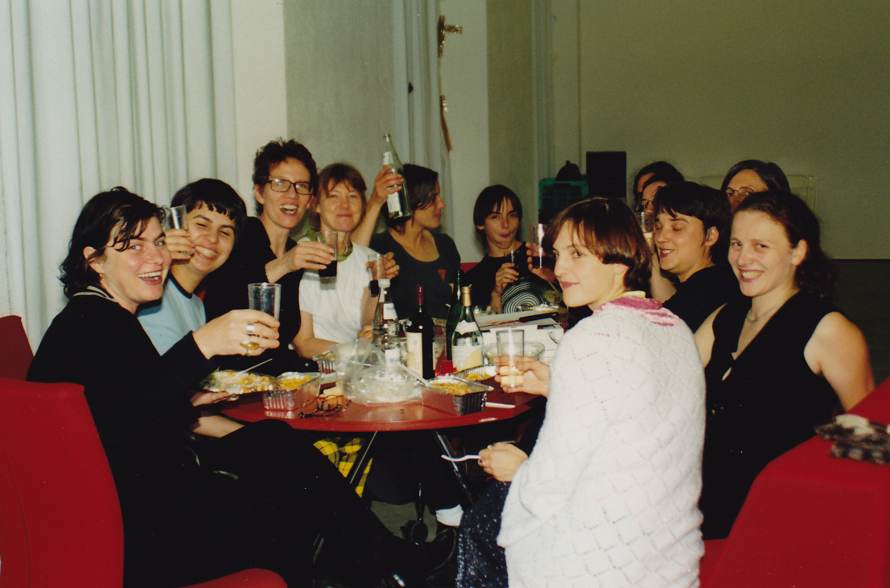
Participants in the First Cyberfeminist International socializing at Hybrid WorkSpace at documenta X. ~1996

> One should always be aware of just how elitist and questionable the choices made by a museum actually are. — Cornelia Sollfrank

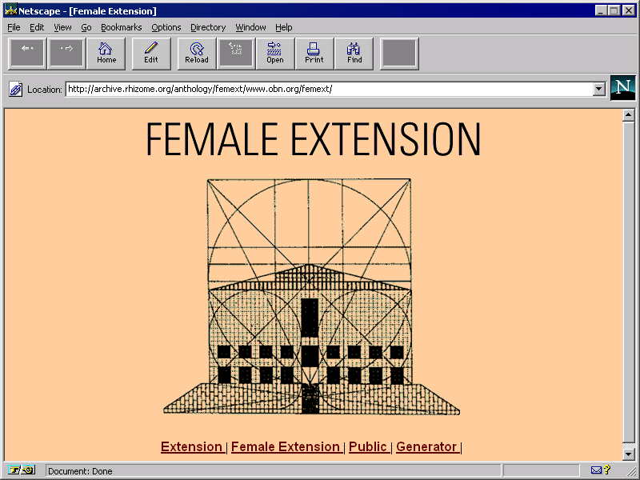

Female Extention (1997) >> [http://artwarez.org/femext/](http://artwarez.org/femext/) >> the "[Generator](https://nag.iap.de/?ac=create&lang=en)"

## Beyond Utalitarian Software

### Social Software

> "[Social Software] primarily, it is software built by and for those of us locked out of the narrowly engineered subjectivity of mainstream software. It is software which asks itself what kind of currents, what kinds of machine, numerical, social, and other dynamics, it feeds in and out of, and what others can be brought into being" furthermore, "It is software that is directly born, changed, and developed as the result of an ongoing sociability between users and programmers in which demands are made on the practices of coding that exceed their easy fit into standardised social relations" — Fuller, Matthew. Behind the Blip: Essays on the Culture of Software. autonomedia. 2003.

[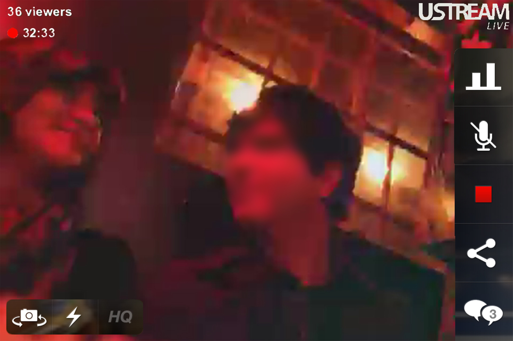](https://lauren-mccarthy.com/Social-Turkers)

[Social Turkers](https://lauren-mccarthy.com/Social-Turkers) (~2013) by Lauren

[Sombody](http://somebodyapp.com/) (2014) by Miranda July

[Follower](https://lauren-mccarthy.com/Follower) (~2015) by Lauren McCarthy

### Critical Software

"...software designed explicitly to pull the rug from underneath normalised understanding of software [...] Critical software engages with existing software programmes and mutates or critically analyses them." (Fuller) Critical Software is software as critical commentary, where thing being commented on is software products && software ideas.

[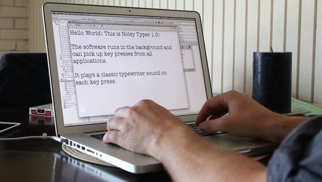](https://vimeo.com/45668483)
[Noisy Typer](https://vimeo.com/45668483) (2012) by Theo Watson

[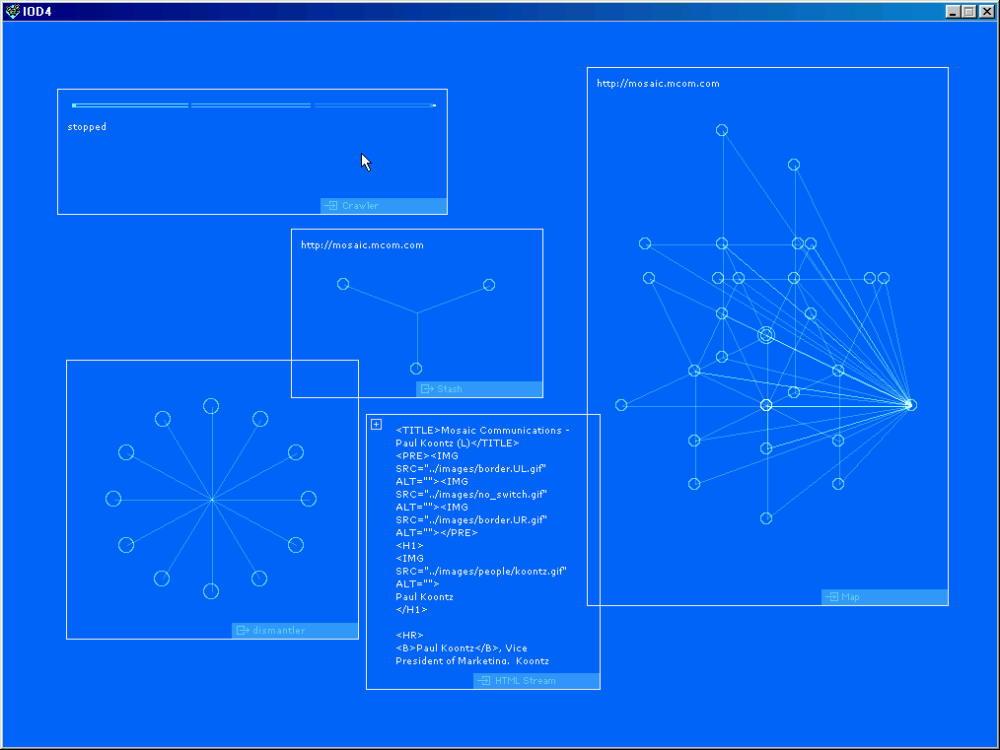](https://anthology.rhizome.org/the-web-stalker)

[Web Stalker](https://anthology.rhizome.org/the-web-stalker) 1997 by I/O/D (Matthew Fuller, Colin Green, Simon Pope) - [Rhizome Article](https://rhizome.org/editorial/2017/feb/17/iod-4-web-stalker/)

### Speculative Software

> "the longest-running vaporware story in the history of the computer industry" — Wolf, Gary. The Curse Of Xanadu. Wired Magazine 1995

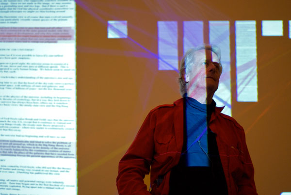

Ted Nelson releasing his Autobiography at the [Internet Archive](https://archive.org/index.php)

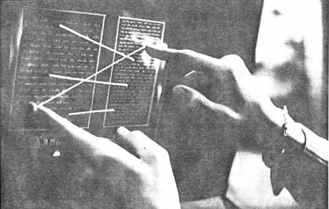

[Xanadu](https://en.wikipedia.org/wiki/Project_Xanadu) (1060-present)

> The best fiction is always also attempting to deal with the crisis of written language, in the way that it asks itself about the legacy built into text as the result of its birth in the keeping of records, in the establishment of laws, in assembling and managing tables of debt and credit. It does this perpetually, at the same time as reinventing and expanding upon the capacity of language to create new things. Speculative software fulfills something of a similar function for digital cultures. (Fuller)

[Beaker Browser](https://beakerbrowser.com/) (~2016) by Paul Frazee and Tara Vancil

## Hacktivist Artware

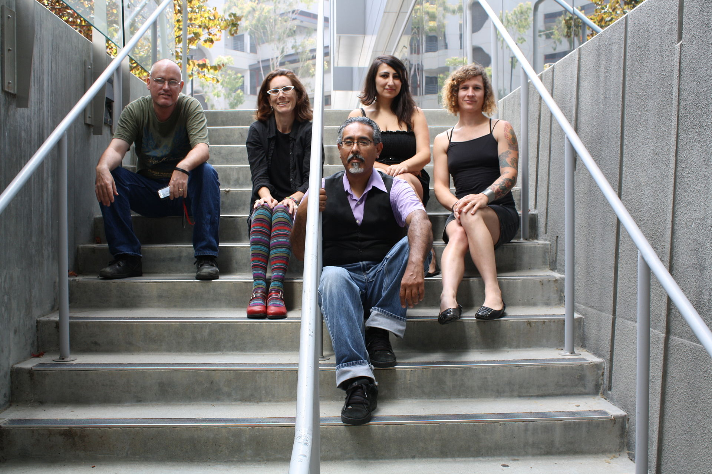
Electronic Disturbance Theater

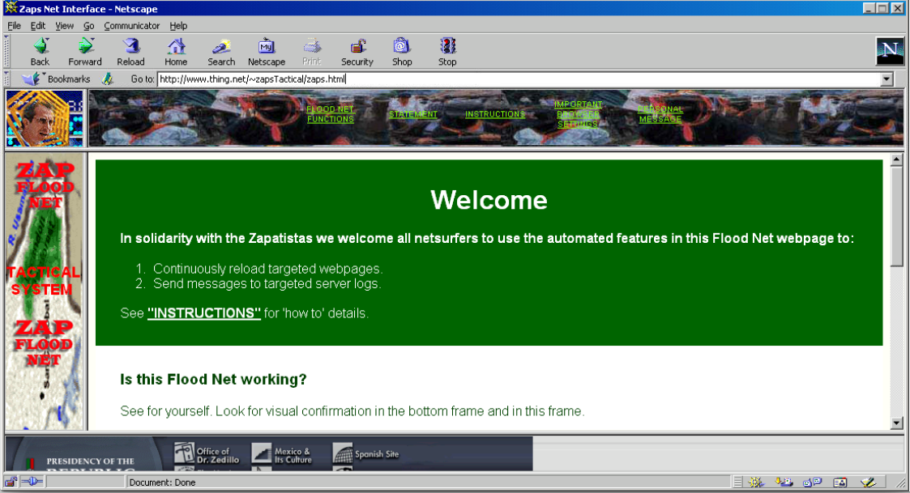
[flood net](https://anthology.rhizome.org/floodnet) (1998) by Electronic Disturbance Theater

[Transborder Immigrant Tool](https://anthology.rhizome.org/transborder-immigrant-tool) (2007-present) by Electronic Disturbance Theater 2.0/b.a.n.g. lab (Micha Cárdenas, Amy Sara Carroll, Ricardo Dominguez, Elle Mehrmand, and Brett Stalbaum)

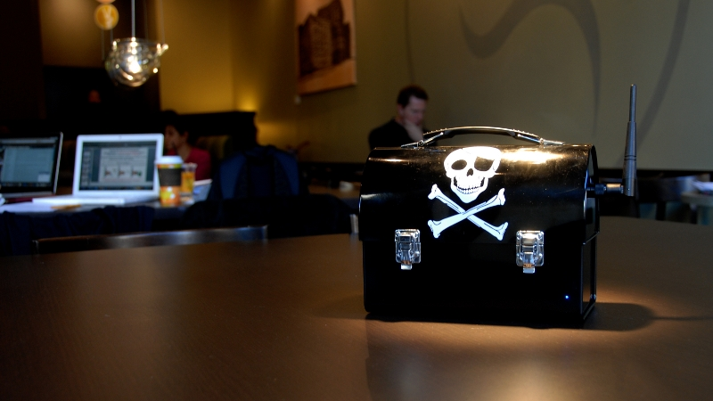

[The Pirate Box](https://piratebox.cc/) (2011) Open Source, started by David Darts, later maintained by Matthias Strubel && Jean Debaecker

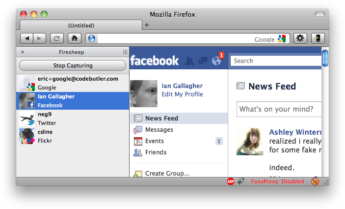

[Firesheep](https://codebutler.com/2010/10/24/firesheep/) (2010) Open Source, started by Eric Butler && Ian Gallagher

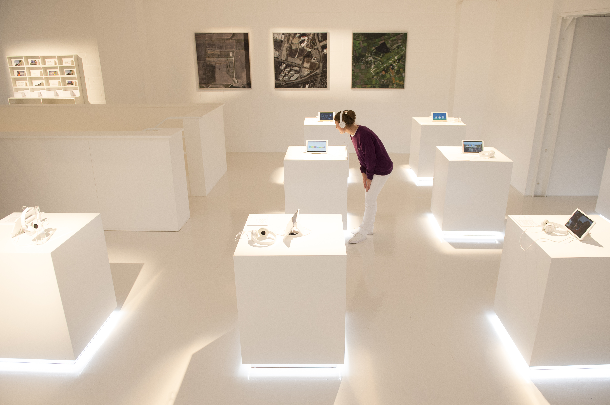

[The Glass Room](https://theglassroom.org/) (2017-present) curated by [Tachical Tech](https://tacticaltech.org/) presented by Firefox ([Mozilla](https://www.mozilla.org/))

included works by Aram Bartholl, [Manuel Beltrán and Nayantara Ranganathan](https://ad.watch/), Tega Brain, [James Bridle](http://citizen-ex.com/), Paolo Cirio, Kate Crawford, MarcDaCosta, Dries Depoorter, Klaas Diersmann, Ingo Diekhaus, DISNOVATION.ORG, Oli Frost, Wesley Goatley, Kyriaki Goni, Adam Harvey, Vladan Joler, La Loma, Sam Lavigne, Noah Levenson, Low Jack, Kiki Mager, !Mediengruppe Bitnik, Joana Moll, Mimi Onuoha, NayanataraRanganathan, Sebastian Schmieg, Share Lab, Tactical Tech, [The Critical Engineering WorkingGroup](https://julianoliver.com/output/newstweek), Unknown Fields.

[interview with Jascha kaykas-Wolff (Chief marketing officer, Mozilla)](https://www.youtube.com/watch?v=yshxBf1ez48)

## social commentary

[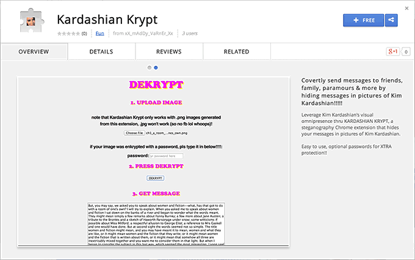](https://cargocollective.com/maddyv/KARDASHIAN-KRYPT)

[Kardashian Krypt](https://cargocollective.com/maddyv/KARDASHIAN-KRYPT) (2014) by
Maddy Varner ([video on Kardashian Krypt && Safe Selfie](https://www.youtube.com/watch?v=dKhMLIcVbE4))

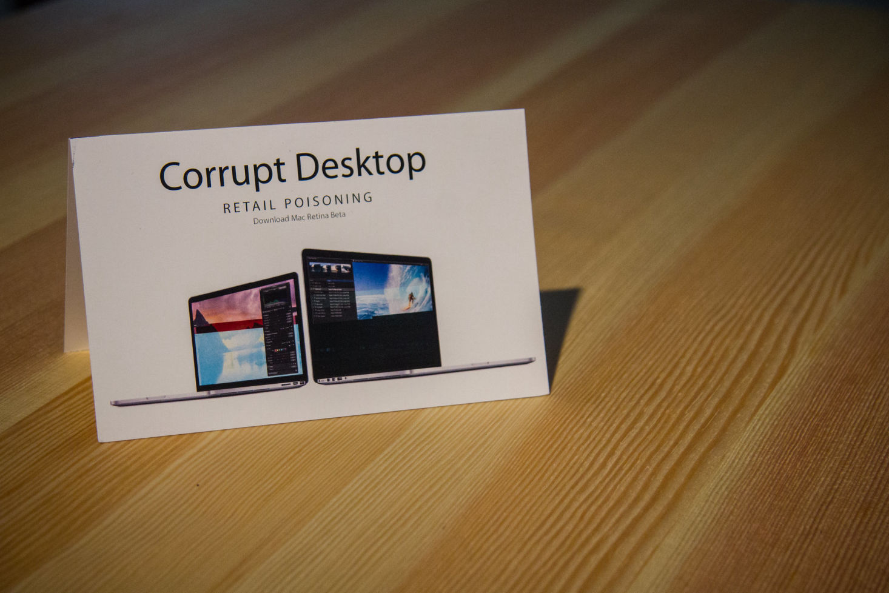

[Corrupt Desktop](http://www.recyclism.com/corruptdesktop.html) (2012 - present) by Recyclism (aka Benjamin Gaulon)

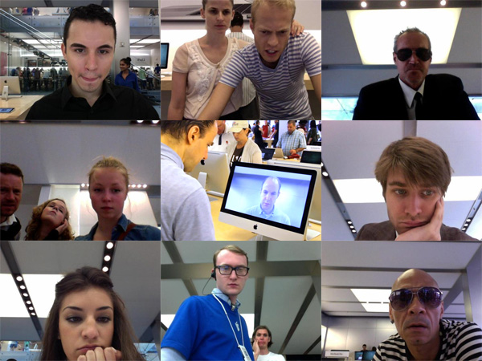

[People Staring at Computers](https://vimeo.com/groups/openframeworks/videos/25958231) (2011) by Kyle McDonald

## Utilitarian Software by artists for artists

[unwriting](http://www.wildernesspuppets.net/yarns/unwriting/howtounwrite/index.html) (~2009) by Barbara Lattanzi

[Wekinator](http://www.wekinator.org/) (2009) by Dr. Rebecca Fiebrink

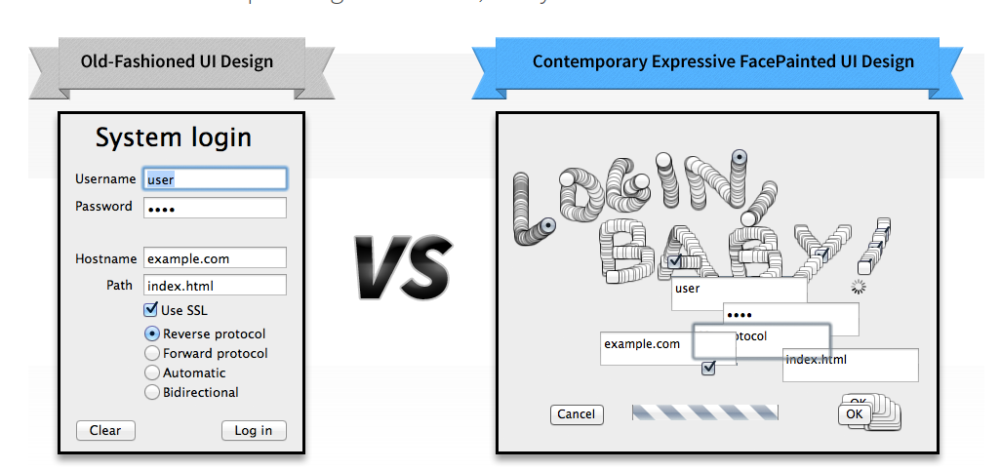

[Inter FacePainter](http://poxparty.com/InterFacePainter/) (~2013) by Pox (formerly PoxParty)

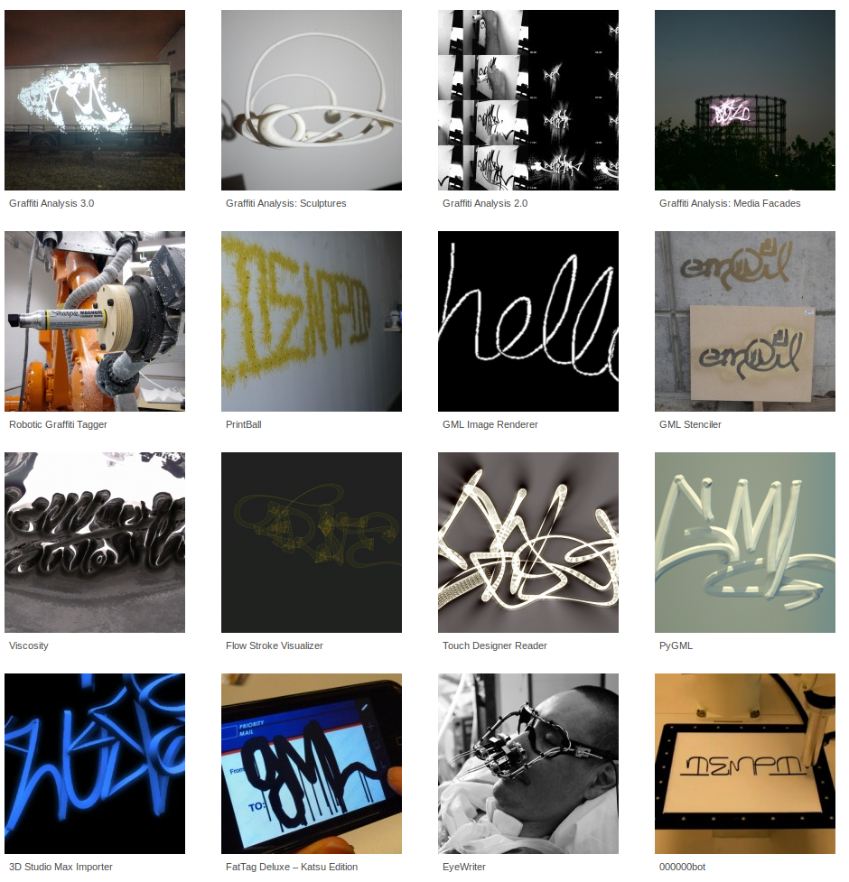

[Graffiti Markup Language](http://www.graffitimarkuplanguage.com/category/projects/) (~2014-present) by Evan Roth, Chris Sugrue, Theo Watson && Jamie Wilkinson

[Processing](https://anthology.rhizome.org/processing) (2001-present) Open Source, founded by Ben Fry && Casey Reas

# beyond the screen

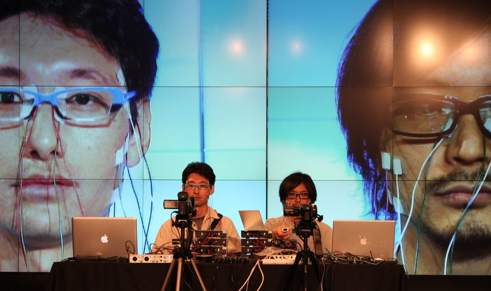

[Face Visualizer aka Face Instrument](https://www.youtube.com/watch?v=pLAma-lrJRM) (2008) by Daito Manabe

> "In one of the pieces of software for the Mac, there's a help function, and if you happen to hit the wrong button, it completely destroys everything. It wrote all sorts of data onto your hard disk. People would get very annyed with this, that it wasn't like ordinary menus and help, all this kind of stuff. Yet these were the people who were supposedly doing this avant-garde art. They just revealed themselves. In the punk day sin England, people would actually kick in their television screens because they were so upset about it, and to me, this project had a similar sort of spirit, and that's why I supported it." interview with Andrew McKenzie. Net Art Anthology (print edition). Rhizome and the New Museum.

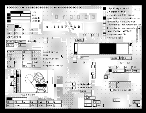

NATO.0+55+3d (1999) by Netochka Nezvanova

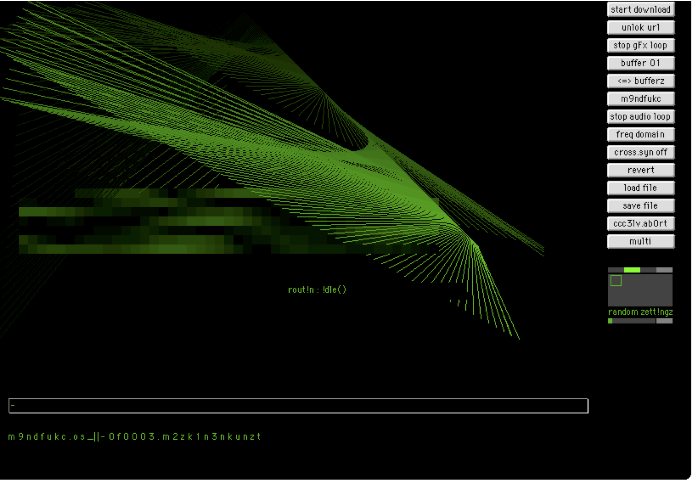

[m9ndfukc.0+99](https://anthology.rhizome.org/m9ndfukc-0-99) (1999) by Netochka Nezvanova

> She's a capitalist who screams anti-capitalism, an artist who infuriates artists, a Net phenomenon who terrorizes her medium. She is a foil, an acid test, a filter that shows us how we respond to her. And, as she herself says, it's how we deal with the likes of her, not the code, that's the hard part of technology. [..] "Technical skills are less important than creative thinking," lectures Netochka in an e-mail. "The epoch of the generalist has arrived -- again. Any fool can program and most do. Software engineers are emotionally inept. In today's unstable + dynamic environment they do not stand a chance." — Mieszkowski, Katharine. [The most feared woman on the Internet](https://www.salon.com/2002/03/01/netochka/). Salon 2002

[interview with Nezvanova](http://artnetweb.com/newsletter/00_02.html) (example of spam like code poetry)
